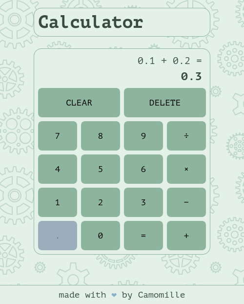

This is my solution to the [calculator app](https://www.theodinproject.com/lessons/foundations-calculator) from The Odin Project.

It rounds numbers to 5 digits to avoid floating point number errors such as $0.1 + 0.2 \neq 0.3$.

